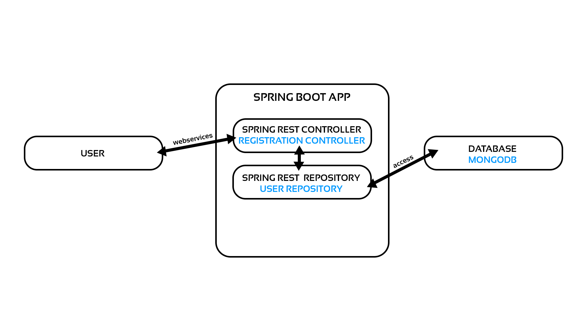
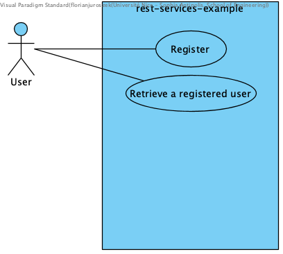

# rest-services-example

Example of two REST services :

- One that allows to register a user ; 
- The other one to displays details of an registered user ;

### Prerequisite

- MongoDB ;

- Maven 3.2+ ;

### Run

- Run MongoDB single server database `./mongod` in your `[INSTALL_DIR]/bin/` folder ;

- Run `mvn clean package` to build the app ;

- Run `mvn spring-boot:run` to run the app ;

### Request examples

- To register a new user :

```
http://[YOUR_URI]/register?email=florian.juroszek@gmail.com&firstName=Florian&lastName=Juroszek&age=22&country=FRANCE
```

- To get an existing user : 

```
http://[YOUR_URI]/user/florian.juroszek@gmail.com
```

### Architecture 



### Use Case diagram


